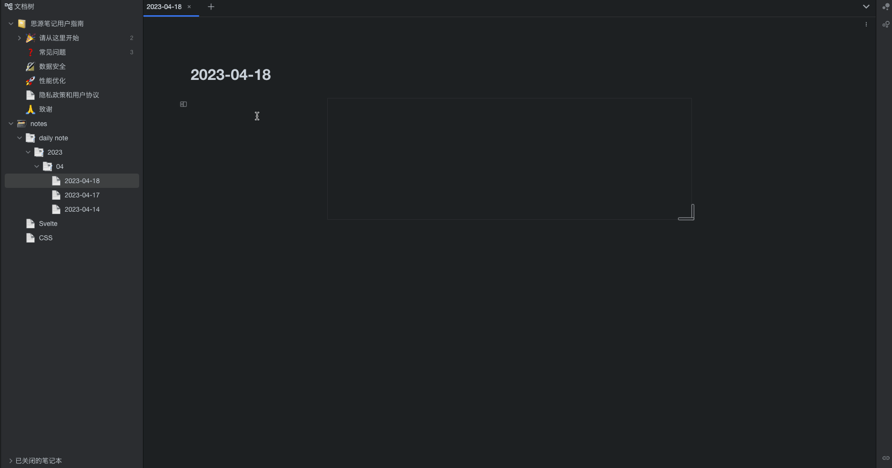
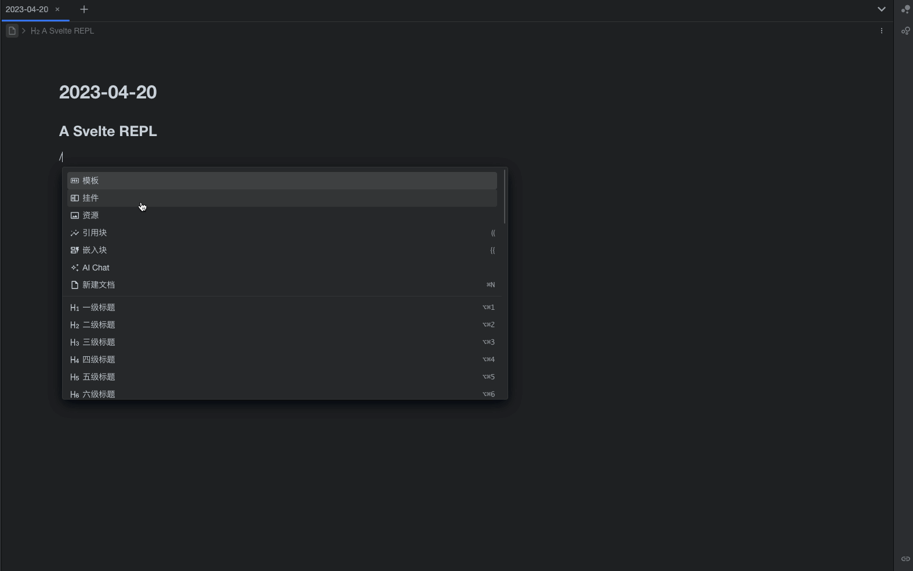
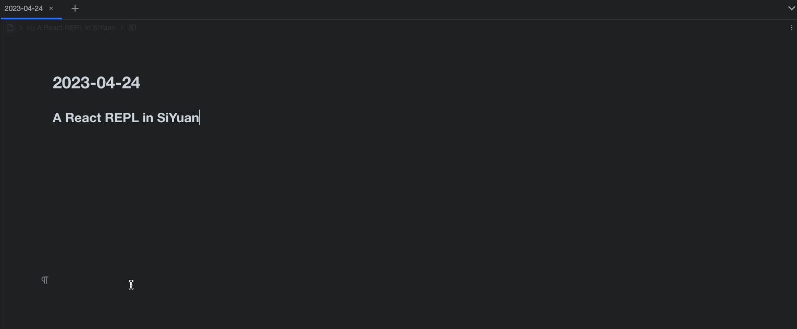

> 
> <SpinningLogo />

<!-- more -->

## 背景

个人目前使用的是[思源笔记](https://github.com/siyuan-note/siyuan)记录笔记，且会有大量 web 前端相关的内容，但是存在这几个问题：

* 思源笔记对主流前端框架（Vue/React/Svelte）代码高亮支持不是很好
* 编写 web 或者 Vue/React/Svelte 相关笔记时，只有代码会稍显枯燥，我希望能辅以展示效果让笔记更直观

## REPL 工具调研

调研了一下三大框架的 REPL 相关库

* [Vue REPL](https://github.com/vuejs/repl)
* [React Live](https://formidable.com/open-source/react-live/)
* [Svelte REPL](https://github.com/sveltejs/sites/tree/master/packages/repl)

:::warning TIP
上述工具中只有 React Live 为非官方，同时 React 也不提供官方 REPL
:::

## 开发思源笔记挂件

思源笔记开放了[官方集市](https://github.com/siyuan-note/bazaar)，其中有：模板、图标、主题、挂件、插件（目前尚未完成）

发现挂件可以很好的满足我的要求，于是分别基于 React/Vue/Svelte 开发了三个挂件，使得在思源笔记中编写各大框架示例成为可能，仓库地址如下：

* [Vue REPL](https://github.com/Blackman99/siyuan-plugin-vue-repl)
* [Svelte REPL](https://github.com/Blackman99/siyuan-plugin-svelte-repl)
* [React REPL](https://github.com/Blackman99/siyuan-plugin-react-repl)

## 如何使用

挂件均已在思源集市中上架

思源笔记 -> 设置 -> 集市 -> 挂件 -> 找到 Vue/React/Svelte REPL -> 安装即可

## 效果演示

<Util-CodeTab
  key-prefix="demo"
  :code-types="['Vue-REPL', 'Svelte-REPL', 'React-REPL']"
  default-active-code-type="Vue-REPL"
  hide-copy
/>

::: slot demo-Vue-REPL

:::

::: slot demo-Svelte-REPL

:::

::: slot demo-React-REPL

:::

## 功能

* 大小自动跟随挂件块
* 代码自动保存，亦可同步云端

## 使用限制

* 一些模块资源使用的是 [esm.sh](https://esm.sh) 以及 [unpkg](https://unpkg.com) 上的资源，使用时需联网

## 结语

希望能帮助到思源笔记的使用者顺利地用 Vue/Svelte/React 记录笔记！

## 参考

* [esm.sh](https://esm.sh)
* [unpkg](https://unpkg.com)
* [思源笔记](https://github.com/siyuan-note/siyuan)
* [Vue REPL](https://github.com/vuejs/repl)
* [React Live](https://formidable.com/open-source/react-live/)
* [Svelte REPL](https://github.com/sveltejs/sites/tree/master/packages/repl)

