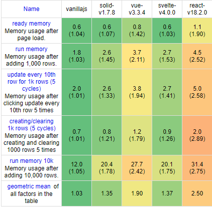
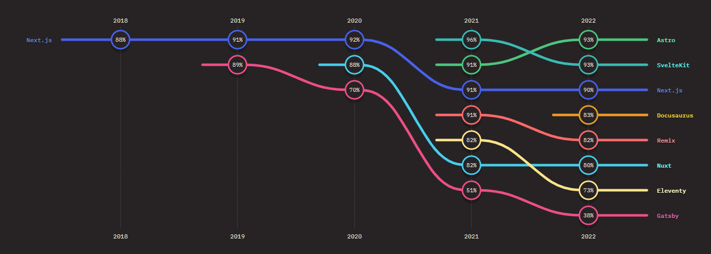

> 如果在 2023 年你仍然因为 React 是受欢迎的库而选择使用它作为你新项目的基础，不妨先看看这篇文章，说不定你会有新的想法

<!-- more -->

如果你是一名前端开发工程师，在大量的招聘信息中你总是会发现需要候选人具备“React”开发能力并理解其原理。  
但是，在 2023 年，我不得不提出这样的建议：**请停止因为 React 受欢迎而选择它**

请不要误解我，首先，我非常认可 React，也非常感谢相关开源社区的贡献者们的努力，作为一个非 React 拥护者（实际上我不是任何一个框架的拥护者），如果我没有接触过任何前端框架的情况下让我做选择的话，我将会非常愿意使用 React 作为项目基础。

可是，我使用过大大小小十几个框架。**如果让现在的我选择一个框架作为新项目的基础，React 不会是首选**

## React 是其他项目的基石

React 为在其之后出现的其他框架提供了很多可以参考借鉴的地方。比如：[Vue3 的组合式 API](https://vuejs.org/api/composition-api-setup.html) 借鉴了 Hooks，Svelte 目前的语法也能见到 JSX 的身影，Solid 的 [`createSignal`](https://docs.solidjs.com/references/api-reference/basic-reactivity/createSignal) 跟 `useState` 用法类似

**但是这些新生代框架都在性能以及开发体验上做了更多的提升**

可能会有人觉得 React 也一直在迭代，在提升，版本也在更新。确实是这样，但是 React 的上限落后于这些新生代框架已是不争的事实，后文中将会列出数据证明这一点

## React 仍然是养家糊口的首选

不得不承认，React 仍然是目前前端领域找工作需求量最大的技能要求。  
如果你因为生活不得不选择它，或者团队里既有的技术栈你无法更改，那我确实也无能为力

## 影响框架选择的因素

作为个人开发者，中小型公司或是大型公司，由于身份的不同，在选择框架时，会有不同的考量

作为个人开发者，我最看重的是性能以及开发体验

作为中小型的公司，可能会考虑开发成本，学习曲线

作为大型公司可能会考虑可持续性，大型复杂应用的可行性

总结一下：

* 性能
* 开发体验
* 开发成本/学习曲线
* 可持续性
* 大型复杂应用的可行性

## 性能

[这里有一个公开的几乎衡量了所有前端框架性能的仓库](https://github.com/krausest/js-framework-benchmark)，你也可以直接访问[数据结果页](https://krausest.github.io/js-framework-benchmark/)

我这里勾选：原生，Vue，Svelte，Solid 以及 React，下面是结果：

* 耗时统计  
  
* 内存占用  
  

可以看到综合性能，React 远远落后于其他框架，同时值得一提的是最年轻的 Solid 反而拥有接近原生的性能

所以你绝对不会因为性能选择 React，因为它是最差的

## 开发体验

在最新的[state of JS 前端框架使用满意度调查中](https://2022.stateofjs.com/en-US/libraries/front-end-frameworks/)，Solid 跟 Svelte 都已经超过 React 了  
Solid 以 90.9% 的满意度名列第一，其次是 Svelte 89.7%

并且，可以清楚的看到从 2019 年开始，React 的满意度持续下降：

Next.js 也排在 SvelteKit 以及 Astro 之后：

所以我想你也不会因为开发体验好而选择 React

## 开发成本/学习成本

如果你同时具有 React，Vue，Svelte，Solid 的使用经验，你绝对不会认为 React 是最容易上手的。并且，在其他框架中已经给你处理好的问题你在 React 中需要手动处理，比如：

* `useEffect` 依赖列表（在其他框架中均是依赖自动追踪）
* 在 React 需要手动避免无限循环，即使你没有写循环（是的，就是这么离谱）
* 

我还可以举出更多的例子，足以证明就开发/学习成本来说，React 非常高

## 可持续性

这个可以理解为社区是否足够庞大以及项目背后的资金支持是否充足

* 社区

毫无疑问，目前为止，React 坐拥前端领域中最大的社区。这一点可能也是最大的优势  
但是，React 具有先发优势，在它出现时，开发者们没有其他像 Solid，Svelte，Vue 的选择

* 资金支持

也许会有人很多人担心这个问题，实际上我在了解之前也非常担心，因为谁都不希望自己所使用的框架在某一天落到无人维护的境地，相信有很多人会因为 React 背靠 Facebook 而选择它

目前我并未在 Solid，Svelte，Vue，Angular 这些框架的社区中看到贡献者不活跃的情况，而且 Angular 背靠谷歌，Svelte 中有两名核心成员被 Vercel 雇佣，Vue 跟 Solid 都拥有巨量的企业捐赠支持，对于这些优秀的知名前端开源框架，资金支持并不会成为问题。

## 大型复杂应用的可行性

React 在坐拥最大社区的同时，也毫无疑问具有最多的项目案例。

但是，这里列举我知道的一些案例帮助你对其他框架建立信心：

* [Apple Music](https://music.apple.com) - Svelte
* [Apple Swift 文档](https://developer.apple.com/documentation/swiftui/) - Vue
* [Open AI](https://openai.com/) - Nuxt/Vue
* [Astro](https://astro.build) - Solid

各大框架自身站点上也有 showcase，感兴趣的话可以自行查看

当然我还可以列举出超过这个数量的 React 站点应用，但是数量并不代表质量，**没有任何一个 web 应用是 React 可以做但是其他框架做不了的**

## 结语

综上所述，只能得到一个结论：**React 除了受欢迎之外已经不具有任何优势**。

如果你能对下一个应用的技术栈做出决策，**请不要因为 React 受欢迎这个理由而选择它**。