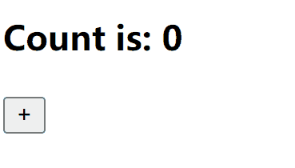

> 一个可用于 React18+ 的原子化状态管理模型，介子那须臾

<!-- more -->

## Github

[Negozio](https://github.com/Blackman99/negozio)

## 安装

```sh
# via npm
npm i --save negozio

# via yarn
yarn add negozio

# via pnpm
pnpm i negozio
```

## 使用 

<Util-CodeTab
  key-prefix="usage"
  :code-types="['App.jsx', 'use-count.js', 'display-count.jsx', 'add-count.jsx']"
  default-active-code-type="App.jsx"
/>

::: slot usage-App.jsx
```jsx
import DisplayCount from './display-count'
import AddCount from './add-count'

export default function App() {
  return <div>
    <DisplayCount />
    <AddCount />
  </div>
}
```
:::

:::: slot usage-use-count.js
```jsx
import negozio from 'negozio'

export const useCount = negozio(0)
```

::: tip 提示
`negozio` 可以接受任何数据类型，如数组，对象等，该函数是基于 [`useSyncExternalStore `](https://react.dev/reference/react/useSyncExternalStore) 的轻量级封装 
:::
::::


::: slot usage-display-count.jsx
```jsx
import useCount from './use-count'

export default function DisplayCount() {
  const [count] = useCount()

  return <h3>Count is: {count}</h3>
}
```
:::

::: slot usage-add-count.jsx
```jsx
import useCount from './use-count'

export default function AddCount() {
  const [, setCount] = useCount()

  return <button onClick={() => setCount(c => c + 1)}>+</button>
}

```
:::




