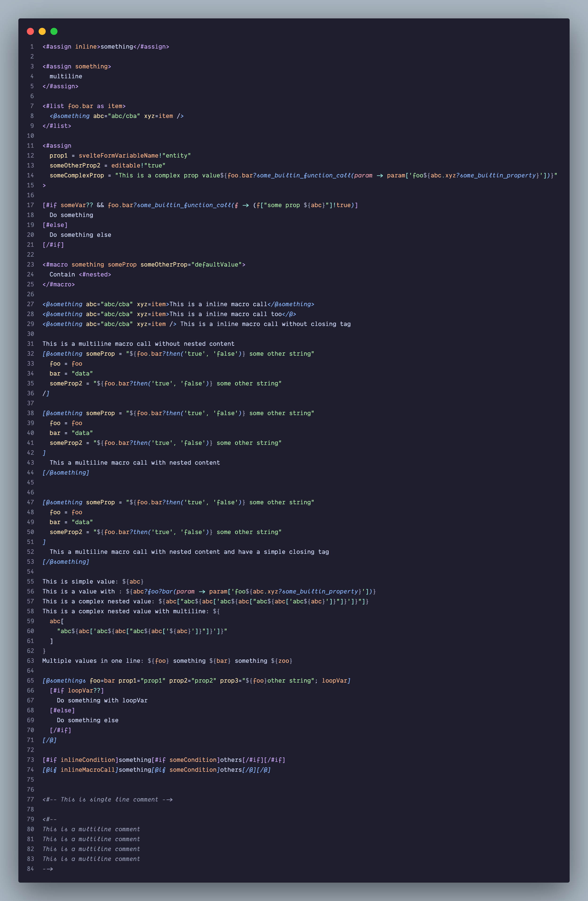
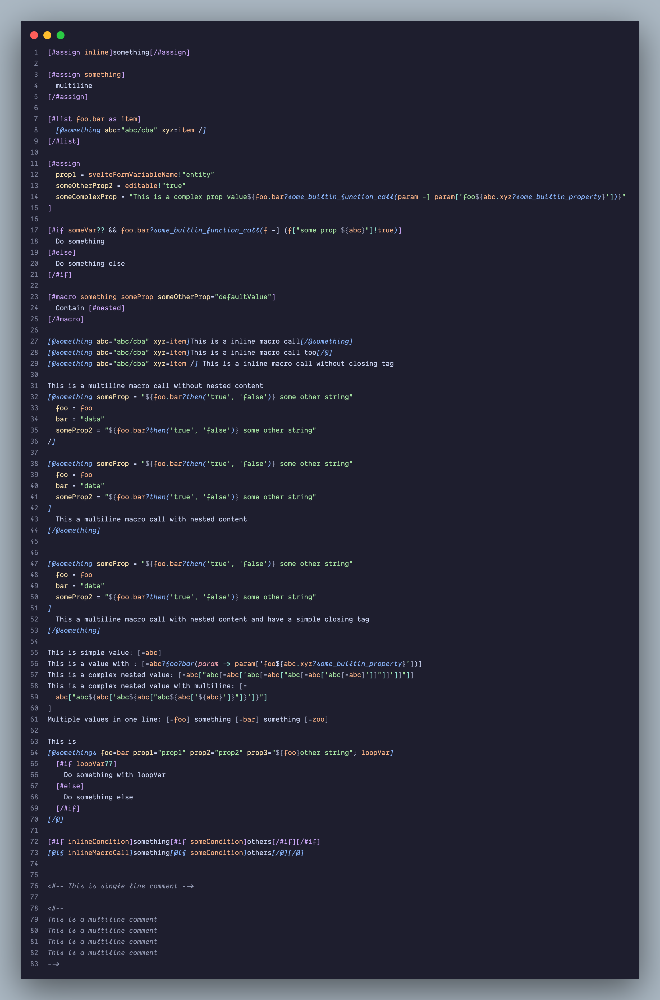

> 在 VSCode 中 提供 freemarker 语言支持

<!-- more -->

## 插件截图

### 普通语法 `<#/>`

### 方括号语法 `[#/]`

## 下载&使用

在 VSCode 中搜索“Freemarker Plus” 下载即可

## 仓库

[Freemarker Plus](https://github.com/sj1-cn/freemarker-vscode)

